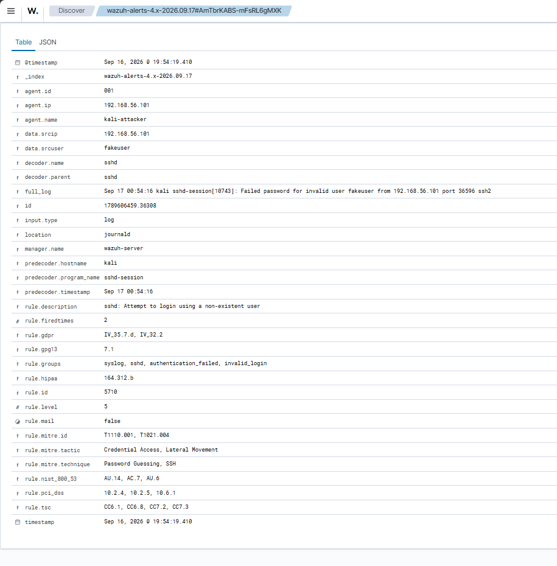
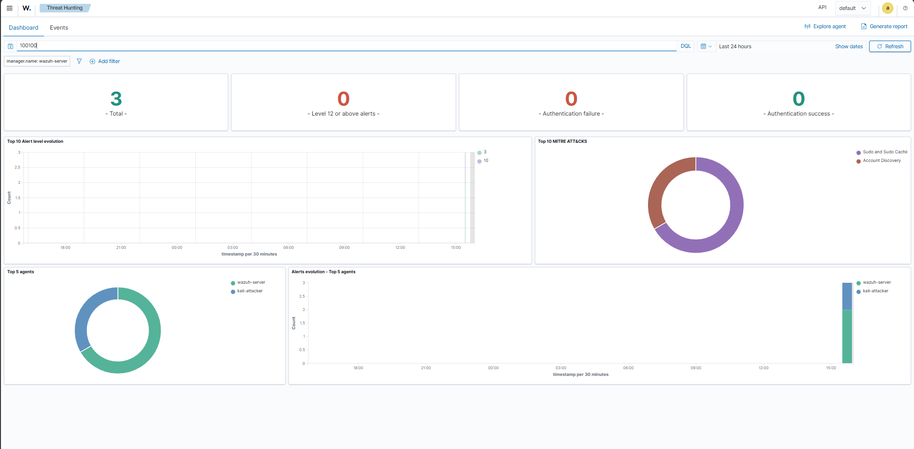
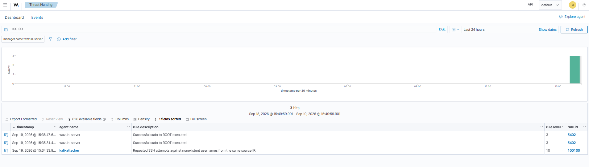

# Wazuh Home SIEM & Detection Engineering Lab

A hands-on cybersecurity home lab built with Wazuh and VirtualBox to develop practical experience in SIEM administration, security monitoring, detection engineering, threat hunting, incident investigation, and controlled attack simulation.

> **Project Status:** Active / Ongoing  
> **Current Phase:** Phase 3 — Detection Development

---

## Project Overview

This project is an evolving cybersecurity home lab designed to provide practical experience with security monitoring and detection engineering in a controlled environment.

The lab currently uses a Wazuh SIEM deployment and a Kali Linux endpoint to generate, collect, analyze, and investigate security telemetry.

Each phase documents implementation, testing, troubleshooting, and lessons learned.

## Current Lab Environment

| Component | Technology |
|---|---|
| Virtualization | VirtualBox |
| SIEM | Wazuh 4.14.7 |
| SIEM Server | Wazuh Manager / Indexer / Dashboard |
| Endpoint | Kali Linux 2026.2 |
| Agent | Wazuh Agent 4.14.7 |
| Network | NAT + VirtualBox Host-Only |
| Telemetry | Journald / SSH |
| Detection | Wazuh built-in & custom rules |

## Current Capabilities

- SIEM deployment and administration
- Endpoint agent deployment
- Security telemetry collection
- SSH authentication monitoring
- Wazuh rule analysis
- Custom detection development
- Detection testing with `wazuh-logtest`
- MITRE ATT&CK mapping
- Threat hunting
- Controlled attack simulation
- Alert investigation
- Infrastructure troubleshooting
- Positive and negative detection validation

## Project Progress

| Phase | Focus | Status |
|---|---|---|
| Phase 0 | Environment Setup & Recovery | ✅ Complete |
| Phase 1 | Wazuh Agent Deployment | ✅ Complete |
| Phase 2 | SIEM Telemetry Validation | ✅ Complete |
| Phase 3 | Detection Development | ✅ Complete |
| Phase 4 | Incident Investigation | 🔄 Planned |
| Future | Additional Endpoints & Detections | 🔄 Planned |

## Detection Engineering

### SSH Repeated Nonexistent-User Detection

**Custom Rule:** `100100`  
**Severity:** Level 10  
**Parent Rule:** `5710`  
**Frequency:** 3 events  
**Timeframe:** 120 seconds

The custom detection identifies repeated SSH attempts involving nonexistent usernames from the same source IP.

```text
Rule 5710
    ↓
3 matching events
    ↓
Same source IP
    ↓
Within 120 seconds
    ↓
Custom Rule 100100
    ↓
Level 10 Alert
```

The detection was tested using `wazuh-logtest`, deployed to the live Wazuh Manager, triggered through controlled SSH activity, and investigated through the Wazuh Dashboard.

### Detection Evidence







## Phase Documentation

- [Phase 0 — Environment Setup & Recovery](phases/phase-0/README.md)
- [Phase 1 — Wazuh Agent Deployment](phases/phase-1/README.md)
- [Phase 2 — SIEM Telemetry Validation](phases/phase-2/README.md)
- [Phase 3 — Detection Development](phases/phase-3/README.md)

## Troubleshooting

The lab documents infrastructure problems rather than hiding them, including Wazuh Indexer startup timeout, service recovery, VirtualBox networking, agent connectivity, and filesystem exhaustion caused by vulnerability-updater temporary data.

## Project Structure

```text
wazuh-home-siem-lab/
├── README.md
├── phases/
├── detections/
├── screenshots/
├── troubleshooting/
└── docs/
```

## Future Development

- Additional custom detections
- Additional monitored endpoints
- Incident investigation workflows
- Alert tuning
- Threat hunting exercises
- Expanded MITRE ATT&CK coverage
- Improved infrastructure monitoring
- Portfolio-oriented case studies

## Disclaimer

This project is conducted in a controlled home laboratory environment for educational and professional development purposes. All attack simulations and security testing are performed against systems owned and operated as part of the lab.
